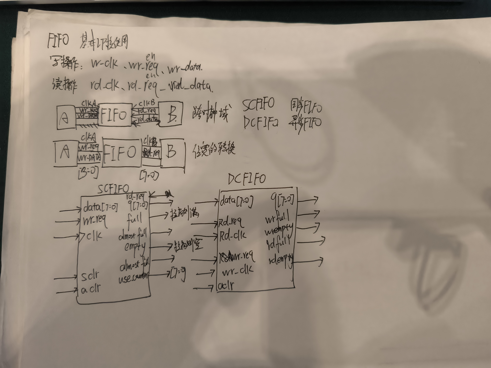

# junction_VeriSilicon_CNN_project
Implementation of convolutional layer verilog for convolutional neural networks
# 卷积层原理及其Verilog实现学习笔记

电子科技大学成都学院 陈家祺 徐彬凯 黄诗佳 聂兴圆 周惺 

## 卷积神经网络（CNN）

卷积可以用来表示一个系统拥有不稳定的输入，但是有稳定的输出求系统存量。

首先根据卷积的数学表达，(f \* g)(t) = ∑\[f(a)g(t-a)\]，

可以形象的理解成一个例子，一个人除了三餐以外一天一直在吃东西，则他在一天24小时中。t时刻进食的量为f（t）,当然他同时在一直消化，消化剩余量的函数是可以建立模型的，为g(x)。这个人肚子里剩余的食物，取决于之前时刻的进食量乘以消化函数，例如x时刻摄入的食物在t时刻的剩余,为f（x）g(t-x),

若我们要求t时刻肚子里剩余的所有食物，则需要将t时刻之前所有时刻的进食量乘以消化函数，即为∑\[f(a)g(t-a)\]，用积分表达则为**∫**f(x)g(t-x)dx。

从我们刚才说的可以知道，t时刻之前。任何时刻的进食都会对现在的食物剩余量产生影响，只是影响大小的关系，例如离t时刻越近，它的影响就越大，刚吃完午饭，肚子里剩余的食物大多数都是刚吃下的。这样就可以引出我们对卷积的第二个理解，把卷积理解成得出给定点对某点的影响，在图像中可以用卷积核来判断周围像素点对当前像素点的影响，通过一个特定的卷积核，也就是滤波器，来检测图像中的特征，类似如下图，用4种不同的卷积核对一个圆形的图片进行卷积的操作，将卷积核的值。与输入层上的值进行相乘并相加作为特征图的一个像素，在匹配的位置。所计算出来的特征值就会非常大可以作为识别图像特征的参考。所以卷积也可以理解为一种滤波器。

当然要构成整一个卷积神经网络，卷积只是其中的一个部分，卷积层在里面的作用是通过卷积核提取图像的特征输出到特征图。其实我们要通过池化，因为往往特征图的特征不是非常的明显，质量不高，所以我们需要对它进行压缩降维的操作，这样在一方面上能增加特征图的质量，并且提高活化能力，在另外一个方面也能通过压缩来减少全连接层的复杂度，以降低计算的成本和参数的数量，还有很重要的一点就是能够减少特征图的维度，有助于降低模型的复杂度，减少过拟合的风险，提高神经网络的泛用能力。接着我们需要激活，通过合适的激活函数，对卷积层的输出进行非线性映射，最后连接至全连接层，这样相较于普通神经网络这样构成的卷基神经网络相较于普通的神经网络，有效降低了连接的数量，降低了参数的数量，同时保证了局部特征，这样能够有效提高模型的泛化能力。

## 对赛道题目的设计

在同一个时钟下有两个不同的卷积层，其中一个是长宽为150的3通道输入，两个步长为1的3×3×3卷积核，另一个是长宽为100的5通道输入，也是两个步长为1的5×5×5卷积核，刚开始看题目以为是三维的卷积，后来发现实际上应该称为三通道卷积，每个卷积核生成的特征图的深度只有1。

个人认为题目的难点在于1.要合理设计卷积核电路的复用从而节省的触发器资源2.自己设计的卷积模块的输入带宽对于RAM_RO_for_sim模块的输出带宽的适应(输入模块有时延特征)。3.卷积核处理的逻辑。

SlidingWindow_module设计和ALU模块设计思路

同步FIFO IP核的设计

因为时间和能力原因，我们只为三通道的卷积层设计了FIFO_SlidingWindow_module，因为数据流较多，并没有采用valid+ready的握手模式，直接采用valid+data的连续传输模式。

我们采用了block ram的同步FIFO设计了将数据层串行输入的int8数据转为矩阵输出给ALU计算单元，采用了滑动窗口输出的设计，两个256深度的8bit宽SCFIFO连成菊花链，3行数据输出，需要例化2个FIFO。

![JW_PPER7H0D)\]3}CZ{NL7\[Y](media/image7.png)

当数据开始输入时，将数据的第 0 行数据存储到 fifo1 中，将第 1 行数据存储到 fifo2 中，当数据的第 2 行的第 0 个数据输入的同时，读取写入 fifo1 中的的第 0 个数据和写入 fifo2 中的第 0 个数据，将三个数据输出给ALU，在输出给ALU的同时，将读取的 fifo2 中的第 0 个数据写入 fifo1 中，fifo1 读出的数据不使用，将输入的第 2 行的数据写入 fifo2 中，当第 2 行的最后一个数据输入，完成前三行的最后一个输出后，第 0 行的数据已读取完成，第 1 行的数据重新写入 fifo1 ，第 2 行的数据写入 fifo2 ，当第 3 行数据开始传入时，开始进行第 1 行、第 2 行和第 3 行的数据输出，如此循环，直到最后一个数据输入，完成数据传给ALU的操作

单个模块使用了104个LUT资源和116个触发器资源，进行完整运算需要例化3个滑窗模块并连接到后方的ALU模块。
